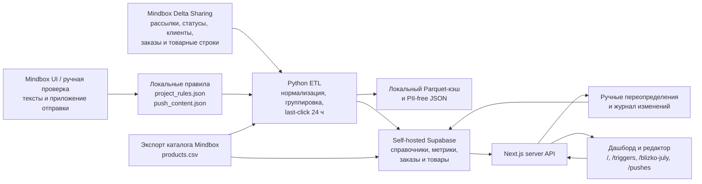
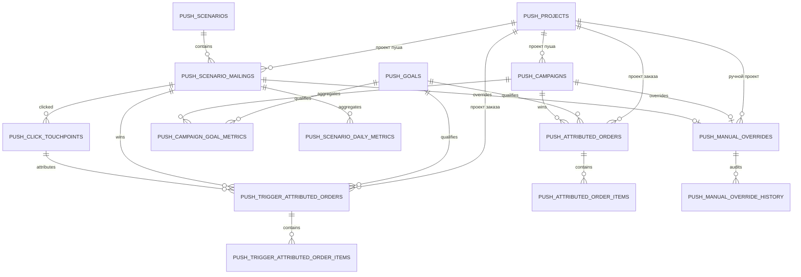

# Push Analytics: архитектура, данные и атрибуция

**Статус:** активный технический справочник

**Последняя сверка с кодом и фактической схемой Supabase:** 30 июля 2026 года

**Проект:** `PushAnalytics/`

## 1. Что делает проект

Push Analytics — локальный веб-дашборд для анализа массовых и триггерных
MobilePush-рассылок 05.ru и Blizko.

Он решает пять основных задач:

1. Забирает из Mindbox факты об отправках, кликах, заказах и товарах.
2. Объединяет Android- и iOS-варианты одного сообщения в логический пуш.
3. Самостоятельно пересчитывает атрибуцию заказов по модели
   **последний клик по MobilePush за 24 часа**.
4. Записывает обезличенные данные в Supabase и показывает их в Next.js-дашборде.
5. Позволяет сотруднику вручную уточнить бизнес-метаданные пуша так, чтобы
   автоматическая синхронизация не перезаписала эти правки.

Настройки атрибуции в самом Mindbox проект не меняет. Атрибуция дашборда
считается отдельно на наших данных и может отличаться от стандартного отчета
Mindbox.

## 2. Главные понятия

В хранилище есть три независимо рассчитанных измерения, которые важно не
смешивать.

| Измерение | Что означает | Как определяется |
| --- | --- | --- |
| **Проект пуша** | В какое приложение отправили сообщение | По конкретной рассылке Mindbox и правилам папки |
| **Цель / сценарий конверсии** | Какой тип заказа считать целевым | По точке контакта и статусу заказа |
| **Проект заказа** | Где покупатель фактически оформил заказ | По `firstPointOfContactInternalId` самого заказа |

Например, пуш мог быть отправлен в основное приложение 05.ru, а заказ после
клика мог быть оформлен в отдельном приложении Blizko. Такой пуш останется в
проекте пуша `05-main`, а покупка получит `order_project_id = blizko-app`.

Основной пользовательский отчет намеренно показывает более узкий бизнес-срез:
для каждого пуша в KPI, рейтинге, таблице и деталях учитываются только покупки,
у которых `order_project_id` совпал с effective-проектом этого пуша. При
мультивыборе проектов условие применяется отдельно к каждому пушу, а не как
общий фильтр проекта покупки.

```text
effective_push_project_id IN selected_project_ids
AND order_project_id = effective_push_project_id
```

Независимые поля в базе сохраняются. Кросс-проектные заказы не удаляются и
нужны для диагностики переходов и проверки классификации, но в основные
бизнес-KPI не входят.

## 3. Общая архитектура



### Основные слои

- `scripts/mindbox_delta.py` — доступ к Delta Sharing Mindbox и локальный
  Parquet-кэш.
- `scripts/build_dashboard_data.py` — массовые пуши и их атрибуция.
- `scripts/build_trigger_dashboard_data.py` — триггерные пуши, дневные метрики
  и их атрибуция.
- `scripts/import_mindbox_products.py` — каталог товаров и названия позиций.
- `scripts/sync_supabase_pg_meta.py` — административная загрузка массовых пушей.
- `scripts/sync_trigger_supabase_pg_meta.py` — административная загрузка
  триггерных пушей.
- `dashboard/` — Next.js-приложение, которое читает Supabase через серверные API.
- `dashboard/app/pushes/` — защищенная служебная страница ручного редактирования.
- `dashboard/app/api/admin/pushes/` — серверный API чтения, сохранения и сброса
  ручных переопределений.

## 4. Откуда берутся данные

### 4.1. Mindbox Delta Sharing

Для чтения используются локальные переменные:

- `URL_DATABASE` — адрес Delta Sharing;
- `SECRET_KEY` — Bearer-токен Delta Sharing.

Скрипт обращается к API изменений таблиц:

```text
/shares/exports/schemas/{schema}/tables/{table}/changes
```

Parquet-файлы сохраняются в `data/raw/`. Папка исключена из Git.

Для каждой бизнес-сущности сохраняется строка с наибольшим
`_rowversion_ts`. Строки с `_isDeleted = true` исключаются. Это превращает
набор изменений Delta в актуальное состояние сущностей.

### 4.2. Используемые таблицы Mindbox

Ниже перечислены не все поля исходных таблиц, а только те, которые нужны
проекту.

| Таблица Mindbox | Что читаем | Для чего |
| --- | --- | --- |
| `Mailings.Mailings` | ID, название, системное название, `type`, `channel`, даты, папка | Выбор MobilePush, разделение `mass` / `trigger`, группировка Android и iOS, проект пуша |
| `Mailings.CustomerMessagesStatuses` | ID экземпляра сообщения, статус, дата, клиент, рассылка; для trigger также сценарий и причины ошибок | `Sent`, `Clicked`, `NotSent`, `NotDelivered`, дневные метрики и клики |
| `ProcessingOrders.Orders` | ID заказа, клиент, `firstDateTimeUtc`, первая точка контакта, сумма со скидками, оплаченная сумма | Время, покупатель, сумма и проект заказа |
| `ProcessingOrders.Purchases` | Заказ, товар, строка, количество, цены и статус позиции | Состав покупки |
| `ProcessingOrders.PurchaseStatuses` | Внутренний статус, категория статуса и внешний статус | Проверка условий четырех целей |
| `CDP.MergedCustomers` | Исходный и объединенный ID клиента | Сведение дублей клиента к одному покупателю |
| `PDP.ProductExternalIds` | Внутренний и внешний ID товара | Связь товарной строки с каталогом |

### 4.3. Тексты пушей и приложение отправки

Delta-данных недостаточно, чтобы надежно получить полный текст каждого
сообщения и его бизнес-проект. Поэтому используется проверенный локальный слой:

- `data/push_content.json` — точные заголовки, тексты и приложения массовых
  пушей, сверенные по Android- и iOS-рассылкам в интерфейсе Mindbox;
- `data/project_rules.json` — назначения проекта массовых рассылок;
- `data/trigger_content.json` — ручные уточнения текстов trigger-сообщений;
- `data/trigger_project_rules.json` — назначения проекта trigger-сообщений.

Для массовых пушей конкретное правило по `mailingId` имеет приоритет над
правилом папки. Неклассифицированные массовые рассылки в отчет не включаются,
чтобы не приписать их неверному приложению.

Для trigger-пушей приоритет такой же: точная рассылка, затем папка. Если
правило отсутствует, текущая реализация использует `05-main` как запасной
проект. Тестовые и sandbox-рассылки исключаются.

Если для trigger-пуша нет ручного текста, заголовок выводится по названию
рассылки, тело остается пустым, а интерфейс помечает контент как определенный
по метаданным Mindbox.

После синхронизации сайт накладывает еще один, более высокий слой —
`push_manual_overrides`. Он используется для оперативных исправлений через
страницу `/pushes`. В таблицу сохраняются только измененные поля; `NULL`
означает, что значение нужно продолжать брать из `push_campaigns` или
`push_scenario_mailings`. Поэтому автоматическая загрузка может обновлять
исходные данные, не удаляя ручные уточнения сотрудника.

### 4.4. Каталог товаров

`ProcessingOrders.Purchases` содержит товарные ID и цены, но не всегда содержит
понятное человеку название. Поэтому каталог выгружается из
`Mindbox → Данные → Продукты` в `data/catalog/products.csv`.

Импортер:

1. Находит внутренние и внешние ID товара.
2. Сопоставляет их с товарными строками заказов.
3. Загружает соответствия в `push_products`.
4. Обновляет `display_name` у уже загруженных товарных строк.

Если товар не найден, интерфейс показывает технический ID/SKU и сообщает, что
название отсутствует в каталоге.

## 5. Как обрабатываются массовые пуши

В массовый отчет попадают рассылки, у которых:

```text
channel = MobilePush
type = mass
```

Android- и iOS-варианты объединяются в одну логическую кампанию по проекту,
месяцу и нормализованному названию. Для сложных исключений используются
ручные правила группировки.

Метрики считаются по уникальным экземплярам сообщения:

- `sent` — есть статус `Sent`;
- `not_delivered` — есть статус `NotDelivered`;
- `delivered` — `max(sent - not_delivered, 0)`;
- `clicked` — есть статус `Clicked`;
- CTR — `clicked / delivered`, если доставка больше нуля.

Важно: в текущем интерфейсе слово **«открыли»** означает событие Mindbox
`Clicked`. Отдельного надежного события простого просмотра push без клика в
используемом наборе нет.

Дата логической кампании — самая ранняя дата `Sent` среди объединенных вариантов.
Кампания получает `attribution_status = complete`, когда после отправки прошло
не менее 24 часов; иначе `collecting`.

## 6. Как обрабатываются триггерные пуши

На страницу `/triggers` попадают только рассылки, у которых:

```text
channel = MobilePush
type = trigger
source entity = Scenario
```

Рассылки `type = transaction` на странице trigger не показываются.

Android- и iOS-варианты объединяются по сценарию и нормализованному названию.
Дневная когорта экземпляра сообщения определяется по дате `Sent`, а если
отправки не было — по `NotSent`, в часовом поясе `Europe/Moscow`.

Для каждого дня сохраняются:

- участники;
- уникальные получатели;
- отправки;
- расчетная доставка;
- клики;
- неотправки;
- недоставки;
- причины неотправки и недоставки.

Сборка trigger-слоя сейчас выполняется полной идемпотентной пересборкой.
`push_delta_cursors` подготовлена для будущей инкрементальной загрузки, но пока
не используется.

## 7. Как определяется атрибуция заказов

### 7.1. Модель

Используется **глобальный последний клик по MobilePush за 24 часа**:

```text
order_time - 24 часа <= click_time <= order_time
```

«Глобальный» означает, что за заказ конкурируют клики по всем MobilePush:

- `mass`;
- `trigger`;
- `transaction`.

Это сделано для того, чтобы один заказ не был одновременно приписан массовому
и триггерному пушу.

### 7.2. Алгоритм

Для каждого заказа выполняются следующие шаги:

1. Исходный ID клиента из заказа преобразуется в канонический ID через
   `CDP.MergedCustomers`. Цепочки объединений проходят до конечного профиля.
2. Для этого канонического покупателя собираются все события `Clicked` по
   MobilePush.
3. Клики сортируются по времени.
4. По времени `firstDateTimeUtc` заказа находится самый поздний клик, который
   произошел не позже заказа.
5. Если клика нет или прошло больше 24 часов, заказ не атрибутируется.
6. Если победил выбранный массовый пуш, заказ попадает в массовый отчет.
7. Если победил trigger-пуш, заказ попадает в trigger-отчет.
8. Если победил transaction-пуш или рассылка вне выбранного набора, заказ не
   показывается ни как массовый, ни как trigger-результат.
9. После выбора пуша заказ проверяется отдельно по каждой цели.

Поздний клик «забирает» заказ у более раннего. Окно считается строго от клика,
а не от отправки или доставки.

### 7.3. Время, сумма и задержка

- Время заказа: `ProcessingOrders.Orders.firstDateTimeUtc`.
- Время клика: дата статуса `Clicked`.
- Задержка: разница между временем заказа и клика в минутах.
- Выручка: `priceWithDiscounts`; если ее нет — `paidAmount`; иначе `0`.
- Задержка агрегируется по диапазонам `0–1`, `1–4`, `4–12` и `12–24` часа.

### 7.4. Цели

Справочник целей хранится в `push_goals`, но квалификация пересчитывается
локально из точки контакта и статусов заказа. Проект не читает готовое число
атрибутированных целей из отчета Mindbox.

| `goal_id` | Цель в интерфейсе | Условие локального расчета |
| --- | --- | --- |
| `blizko-app` | Заказы Blizko (отдельное приложение) | Точка контакта `blizkoios` или `blizkoandroid`; категория позиции `Paid` или `Delivered` |
| `05-app` | Заказы в приложении (ИМ) | Точка контакта Android/iOS основного приложения; категория `CheckedOut` |
| `blizko-in-05` | Заказ в Blizko | Точка контакта Darkstore внутри 05.ru; внешний статус `Create` |
| `all-orders` | Заказы | Есть категория `CheckedOut`, `Paid` или `Delivered` |

`all-orders` означает все заказы, достигшие одного из признанных покупочных
статусов, а не каждый сырой объект заказа в Mindbox.

Один физический заказ может соответствовать нескольким целям. Поэтому в
`push_attributed_orders` и `push_trigger_attributed_orders` он хранится
отдельной строкой для каждой подходящей цели. Внутри одной выбранной цели заказ
учитывается один раз.

Для массовых пушей зерно атрибуции:

```text
campaign_id + goal_id + order_key
```

Для trigger-пушей один и тот же заказ может иметь только одного глобального
trigger-победителя на цель:

```text
goal_id + order_key
```

## 8. Как определяется проект

### 8.1. Проект пуша

Справочник содержит три проекта:

| ID | Название | Смысл |
| --- | --- | --- |
| `blizko-app` | Отдельное приложение Blizko | Отдельное приложение доставки продуктов |
| `05-main` | Основной проект 05.ru | Основное приложение и интернет-магазин техники |
| `blizko-in-05` | Blizko внутри приложения 05.ru | Доставка продуктов внутри приложения 05.ru |

Проект пуша сохраняется в `push_campaigns.project_id` или
`push_scenario_mailings.project_id`.

При чтении сайта действует следующий приоритет:

1. `push_manual_overrides.project_id`, если сотрудник явно изменил проект;
2. синхронизированный `project_id` кампании или trigger-сообщения;
3. правила `project_rules.json` / `trigger_project_rules.json` применяются
   раньше, во время ETL, и формируют синхронизированное значение.

Переопределение проекта применяется до фильтрации дашборда. Оно меняет проект
пуша, но не меняет `order_project_id` уже атрибутированных покупок. Поэтому
ручное изменение проекта сразу пересчитывает, какие существующие покупки
входят в same-project срез этого пуша.

### 8.2. Проект покупки

Проект покупки определяется независимо по
`ProcessingOrders.Orders.firstPointOfContactInternalId`. Соответствие хранится
в `push_order_project_points`.

| Проект | ID точки контакта | Название Mindbox |
| --- | --- | --- |
| `05-main` | `10` | Android приложение |
| `05-main` | `11` | iOS приложение |
| `05-main` | `9` | Сайт |
| `05-main` | `43bce559-5c95-4967-82d9-3985cc97d614` | Маркетплейс |
| `blizko-app` | `97f9a0dd-62d5-4e6c-8538-d4d00ffe221a` | blizkoios |
| `blizko-app` | `af005e5f-d68b-462d-9dbb-c3b5e9a9617b` | blizkoandroid |
| `blizko-app` | `a349e806-a88e-432b-be10-0d8746f4d6e5` | blizkoandroidsandbox |
| `blizko-in-05` | `70e2ff71-c63d-4061-a1c3-4282860287aa` | AndroidAppDarkstore |
| `blizko-in-05` | `998ee3ed-7579-43f9-8fe1-4129fb0805f6` | IosAppDarkstore |
| `blizko-in-05` | `a1e1fd26-d7fd-416a-8447-b528dc8e12cd` | Darkstore |

Результат сохраняется в `order_project_id`. Основной отчет сравнивает это поле
с effective-проектом конкретного пуша; отдельного пользовательского фильтра
проекта покупки больше нет.

## 9. Модель данных Supabase

Фактическая схема на 30 июля 2026 года содержит **19 таблиц и 3
представления**. Ниже указан полный набор полей, используемый текущей версией.
Знак `?` означает, что значение может быть `NULL`.

### 9.1. Справочники и правила

#### `push_projects`

Справочник проектов пуша и заказа.

| Поле | Тип | Назначение |
| --- | --- | --- |
| `id` | `text` | Стабильный ID проекта |
| `name` | `text` | Полное название |
| `short_name` | `text` | Короткое название |
| `description` | `text` | Описание |
| `sort_order` | `smallint` | Порядок в интерфейсе |
| `is_active` | `boolean` | Доступность проекта |
| `created_at` | `timestamptz` | Создание строки |
| `updated_at` | `timestamptz` | Последнее обновление |

#### `push_goals`

Справочник переключаемых целей.

| Поле | Тип | Назначение |
| --- | --- | --- |
| `id` | `text` | ID цели |
| `name` | `text` | Полное название |
| `short_name` | `text` | Короткое название |
| `description` | `text` | Условие цели |
| `sort_order` | `smallint` | Порядок |
| `is_active` | `boolean` | Активность |
| `created_at` | `timestamptz` | Создание |
| `updated_at` | `timestamptz` | Обновление |

#### `push_project_rules`

Аудируемые правила назначения проекта рассылке.

| Поле | Тип | Назначение |
| --- | --- | --- |
| `id` | `bigint` | ID правила |
| `project_id` | `text` | Ссылка на `push_projects` |
| `match_field` | `text` | Поле сопоставления, например рассылка или папка |
| `match_value` | `text` | Значение для точного совпадения |
| `priority` | `smallint` | Приоритет |
| `notes` | `text?` | Обоснование |
| `is_active` | `boolean` | Используется ли правило |
| `created_at` | `timestamptz` | Создание |
| `updated_at` | `timestamptz` | Обновление |

#### `push_order_project_points`

Справочник связи точки контакта заказа с проектом.

| Поле | Тип | Назначение |
| --- | --- | --- |
| `point_id` | `text` | `firstPointOfContactInternalId` |
| `point_name` | `text` | Название точки |
| `project_id` | `text` | Ссылка на `push_projects` |
| `notes` | `text` | Комментарий |
| `created_at` | `timestamptz` | Создание |
| `updated_at` | `timestamptz` | Обновление |

#### `push_products`

Локальный справочник товаров из CSV-каталога Mindbox.

| Поле | Тип | Назначение |
| --- | --- | --- |
| `product_internal_id` | `text` | Внутренний ID Mindbox |
| `name` | `text` | Название товара |
| `vendor_code` | `text?` | Артикул |
| `external_id` | `text?` | Внешний ID |
| `external_system_id` | `text?` | Внешняя система |
| `picture_url` | `text?` | Изображение |
| `source` | `text` | Источник записи |
| `source_updated_at` | `timestamptz?` | Обновление в источнике |
| `created_at` | `timestamptz` | Создание |
| `updated_at` | `timestamptz` | Обновление |

### 9.2. Массовые пуши

#### `push_campaigns`

Одна строка — одна логическая массовая кампания после объединения платформ.

| Поле | Тип | Назначение |
| --- | --- | --- |
| `id` | `bigint` | Внутренний ID кампании |
| `campaign_key` | `text` | Стабильный ключ группировки |
| `project_id` | `text` | Проект пуша |
| `project_assignment_source` | `text` | Источник классификации |
| `project_assignment_reason` | `text?` | Обоснование классификации |
| `name` | `text` | Название кампании |
| `title` | `text` | Заголовок пуша |
| `body` | `text` | Текст пуша |
| `sent_at` | `timestamptz` | Дата первой отправки |
| `attribution_status` | `text` | `collecting` или `complete` |
| `attribution_window_hours` | `smallint` | Сейчас `24` |
| `attribution_model` | `text` | Сейчас `last_click` |
| `source` | `text` | Источник данных |
| `mailing_ids` | `text[]` | Android/iOS ID Mindbox |
| `folder_internal_ids` | `text[]` | Папки Mindbox |
| `sent` | `bigint` | Отправлено |
| `delivered` | `bigint` | Расчетно доставлено |
| `clicked` | `bigint` | Кликнули |
| `not_delivered` | `bigint` | Не доставлено |
| `platform_ios` | `bigint` | iOS-отправки |
| `platform_android` | `bigint` | Android-отправки |
| `platform_unknown` | `bigint` | Неопределенная платформа |
| `generated_at` | `timestamptz` | Время расчета набора |
| `created_at` | `timestamptz` | Создание |
| `updated_at` | `timestamptz` | Обновление |
| `application_names` | `text[]` | Фактические приложения отправки |

#### `push_campaign_goal_metrics`

Агрегат на пару «массовая кампания × цель».

| Поле | Тип | Назначение |
| --- | --- | --- |
| `campaign_id` | `bigint` | Кампания |
| `goal_id` | `text` | Цель |
| `orders` | `bigint` | Заказы |
| `revenue` | `numeric(16,2)` | Выручка |
| `latency_0_1h` | `bigint` | Заказы за 0–1 час |
| `latency_1_4h` | `bigint` | Заказы за 1–4 часа |
| `latency_4_12h` | `bigint` | Заказы за 4–12 часов |
| `latency_12_24h` | `bigint` | Заказы за 12–24 часа |
| `generated_at` | `timestamptz` | Время расчета |
| `created_at` | `timestamptz` | Создание |
| `updated_at` | `timestamptz` | Обновление |
| `buyers` | `bigint` | Уникальные покупатели внутри кампании и цели |

#### `push_attributed_orders`

Обезличенные атрибутированные заказы массовых пушей. Один физический заказ
может иметь несколько строк для разных целей.

| Поле | Тип | Назначение |
| --- | --- | --- |
| `id` | `bigint` | ID строки |
| `campaign_id` | `bigint` | Кампания-победитель |
| `goal_id` | `text` | Подходящая цель |
| `order_key` | `text` | SHA-256 вместо исходного номера заказа |
| `purchased_at` | `timestamptz` | Время заказа |
| `attributed_click_at` | `timestamptz` | Время победившего клика |
| `latency_minutes` | `integer` | Задержка клик → заказ |
| `revenue` | `numeric(16,2)` | Сумма заказа |
| `first_point_of_contact_id` | `text?` | Точка первого контакта |
| `status_categories` | `text[]` | Категории статусов позиций |
| `status_external_ids` | `text[]` | Внешние статусы |
| `generated_at` | `timestamptz` | Время расчета |
| `created_at` | `timestamptz` | Создание |
| `updated_at` | `timestamptz` | Обновление |
| `buyer_key` | `text` | Необратимый ключ покупателя |
| `order_project_id` | `text` | Фактический проект заказа |

#### `push_attributed_order_items`

Товарные строки атрибутированных массовым пушам заказов.

| Поле | Тип | Назначение |
| --- | --- | --- |
| `id` | `bigint` | ID строки |
| `attributed_order_id` | `bigint` | Ссылка на заказ |
| `line_key` | `text` | Ключ строки |
| `product_internal_id` | `text?` | Внутренний ID товара |
| `product_external_id` | `text?` | Внешний ID товара |
| `product_external_system_id` | `text?` | Внешняя система |
| `display_name` | `text` | Название или безопасный fallback |
| `quantity` | `numeric(14,3)` | Количество |
| `quantity_type` | `text?` | Тип количества |
| `unit_price` | `numeric(16,2)?` | Цена единицы |
| `line_amount` | `numeric(16,2)?` | Сумма строки |
| `status_internal_id` | `text?` | Внутренний статус |
| `status_category` | `text?` | Категория статуса |
| `status_external_id` | `text?` | Внешний статус |
| `created_at` | `timestamptz` | Создание |
| `updated_at` | `timestamptz` | Обновление |

#### `push_campaign_goal_order_project_metrics`

Представление для разреза «кампания × цель × проект покупки».

| Поле | Тип |
| --- | --- |
| `campaign_id` | `bigint?` |
| `goal_id` | `text?` |
| `order_project_id` | `text?` |
| `orders` | `bigint?` |
| `buyers` | `bigint?` |
| `revenue` | `numeric(16,2)?` |
| `latency_0_1h` | `bigint?` |
| `latency_1_4h` | `bigint?` |
| `latency_4_12h` | `bigint?` |
| `latency_12_24h` | `bigint?` |

### 9.3. Триггерные пуши

#### `push_scenarios`

Справочник сценариев Mindbox.

| Поле | Тип | Назначение |
| --- | --- | --- |
| `id` | `bigint` | Внутренний ID |
| `mindbox_scenario_id` | `text` | ID сценария Mindbox |
| `name` | `text` | Название |
| `source_entity_type` | `text` | Тип сущности-источника |
| `first_activity_at` | `timestamptz?` | Первая активность |
| `last_activity_at` | `timestamptz?` | Последняя активность |
| `is_active` | `boolean` | Активность |
| `generated_at` | `timestamptz` | Время расчета |
| `created_at` | `timestamptz` | Создание |
| `updated_at` | `timestamptz` | Обновление |

#### `push_scenario_mailings`

Логические trigger-сообщения, объединяющие платформенные варианты.

| Поле | Тип | Назначение |
| --- | --- | --- |
| `id` | `bigint` | ID сообщения |
| `scenario_id` | `bigint` | Сценарий |
| `project_id` | `text` | Проект пуша |
| `message_key` | `text` | Стабильный ключ |
| `project_assignment_source` | `text` | Источник классификации |
| `project_assignment_reason` | `text?` | Обоснование |
| `name` | `text` | Название |
| `title` | `text` | Заголовок |
| `body` | `text` | Текст |
| `mailing_type` | `text` | Для страницы должен быть `trigger` |
| `mailing_ids` | `text[]` | ID рассылок Mindbox |
| `folder_internal_ids` | `text[]` | Папки |
| `application_names` | `text[]` | Приложения |
| `platforms` | `text[]` | Платформы |
| `content_source` | `text` | Откуда получен текст |
| `first_activity_at` | `timestamptz?` | Первая активность |
| `last_activity_at` | `timestamptz?` | Последняя активность |
| `mindbox_created_at` | `timestamptz?` | Создание в Mindbox |
| `mindbox_updated_at` | `timestamptz?` | Обновление в Mindbox |
| `is_test` | `boolean` | Тестовая рассылка |
| `generated_at` | `timestamptz` | Время расчета |
| `created_at` | `timestamptz` | Создание |
| `updated_at` | `timestamptz` | Обновление |

#### `push_scenario_daily_metrics`

Дневная когорта одного trigger-сообщения.

| Поле | Тип | Назначение |
| --- | --- | --- |
| `scenario_mailing_id` | `bigint` | Trigger-сообщение |
| `metric_date` | `date` | День когорты |
| `participants` | `bigint` | Участники |
| `unique_recipients` | `bigint` | Уникальные получатели |
| `sent` | `bigint` | Отправлено |
| `delivered_estimated` | `bigint` | Расчетно доставлено |
| `clicked` | `bigint` | Кликнули |
| `not_sent` | `bigint` | Не отправлено |
| `not_delivered` | `bigint` | Не доставлено |
| `not_sent_reasons` | `jsonb` | Причины неотправки |
| `not_delivered_reasons` | `jsonb` | Причины недоставки |
| `generated_at` | `timestamptz` | Время расчета |
| `created_at` | `timestamptz` | Создание |
| `updated_at` | `timestamptz` | Обновление |

#### `push_click_touchpoints`

Закрытый обезличенный слой победивших trigger-кликов, необходимых для связи с
заказами. Полный поток конкурирующих кликов обрабатывается в ETL и в эту
таблицу не публикуется.

| Поле | Тип | Назначение |
| --- | --- | --- |
| `id` | `bigint` | ID клика |
| `touchpoint_key` | `text` | HMAC-ключ точки контакта |
| `source_kind` | `text` | Тип источника |
| `campaign_id` | `bigint?` | Массовая кампания, если применимо |
| `scenario_mailing_id` | `bigint?` | Trigger-сообщение, если применимо |
| `project_id` | `text` | Проект пуша |
| `mailing_internal_id` | `text` | ID рассылки |
| `message_instance_key` | `text` | HMAC экземпляра сообщения |
| `buyer_key` | `text` | HMAC покупателя |
| `clicked_at` | `timestamptz` | Время клика |
| `generated_at` | `timestamptz` | Время расчета |
| `created_at` | `timestamptz` | Создание |
| `updated_at` | `timestamptz` | Обновление |

#### `push_trigger_attributed_orders`

Обезличенные заказы, где глобальный last-click победитель — trigger-пуш.

| Поле | Тип | Назначение |
| --- | --- | --- |
| `id` | `bigint` | ID строки |
| `scenario_mailing_id` | `bigint` | Trigger-сообщение |
| `touchpoint_id` | `bigint` | Победивший клик |
| `goal_id` | `text` | Цель |
| `order_project_id` | `text` | Проект покупки |
| `order_key` | `text` | SHA-256 заказа |
| `buyer_key` | `text` | HMAC покупателя |
| `purchased_at` | `timestamptz` | Время покупки |
| `attributed_click_at` | `timestamptz` | Время клика |
| `latency_minutes` | `integer` | Задержка |
| `revenue` | `numeric(16,2)` | Сумма |
| `first_point_of_contact_id` | `text?` | Точка контакта |
| `status_categories` | `text[]` | Категории статусов |
| `status_external_ids` | `text[]` | Внешние статусы |
| `generated_at` | `timestamptz` | Время расчета |
| `created_at` | `timestamptz` | Создание |
| `updated_at` | `timestamptz` | Обновление |

#### `push_trigger_attributed_order_items`

Товарные строки trigger-заказов.

| Поле | Тип | Назначение |
| --- | --- | --- |
| `id` | `bigint` | ID строки |
| `attributed_order_id` | `bigint` | Заказ |
| `line_key` | `text` | Ключ строки |
| `product_internal_id` | `text?` | Внутренний ID товара |
| `product_external_id` | `text?` | Внешний ID |
| `product_external_system_id` | `text?` | Внешняя система |
| `display_name` | `text` | Название или fallback |
| `quantity` | `numeric(14,3)` | Количество |
| `quantity_type` | `text?` | Тип количества |
| `unit_price` | `numeric(16,2)?` | Цена единицы |
| `line_amount` | `numeric(16,2)?` | Сумма строки |
| `status_internal_id` | `text?` | Внутренний статус |
| `status_category` | `text?` | Категория статуса |
| `status_external_id` | `text?` | Внешний статус |
| `created_at` | `timestamptz` | Создание |
| `updated_at` | `timestamptz` | Обновление |
| `generated_at` | `timestamptz` | Маркер снимка |

#### `push_trigger_goal_metrics`

Представление агрегатов «trigger-сообщение × цель».

| Поле | Тип |
| --- | --- |
| `scenario_mailing_id` | `bigint?` |
| `goal_id` | `text?` |
| `orders` | `bigint?` |
| `buyers` | `bigint?` |
| `revenue` | `numeric?` |
| `latency_0_1h` | `bigint?` |
| `latency_1_4h` | `bigint?` |
| `latency_4_12h` | `bigint?` |
| `latency_12_24h` | `bigint?` |

#### `push_trigger_goal_order_project_metrics`

Представление агрегатов «trigger-сообщение × цель × проект покупки».

| Поле | Тип |
| --- | --- |
| `scenario_mailing_id` | `bigint?` |
| `goal_id` | `text?` |
| `order_project_id` | `text?` |
| `orders` | `bigint?` |
| `buyers` | `bigint?` |
| `revenue` | `numeric?` |
| `latency_0_1h` | `bigint?` |
| `latency_1_4h` | `bigint?` |
| `latency_4_12h` | `bigint?` |
| `latency_12_24h` | `bigint?` |

### 9.4. Служебные таблицы

#### `push_manual_overrides`

Разреженный слой ручных бизнес-правок. Ровно один из внешних ключей
`campaign_id` и `scenario_mailing_id` должен быть заполнен.

| Поле | Тип | Назначение |
| --- | --- | --- |
| `id` | `bigint` | ID переопределения |
| `source_kind` | `text` | `mass` или `trigger` |
| `campaign_id` | `bigint?` | Массовая кампания |
| `scenario_mailing_id` | `bigint?` | Trigger-сообщение |
| `project_id` | `text?` | Ручной проект пуша |
| `name` | `text?` | Ручное рабочее название |
| `title` | `text?` | Ручной заголовок |
| `body` | `text?` | Ручной текст |
| `application_names` | `text[]?` | Ручной список приложений |
| `notes` | `text?` | Внутренний комментарий сотрудника |
| `is_hidden` | `boolean?` | Исключить пуш из дашбордов |
| `changed_by` | `text` | Имя сотрудника |
| `created_at` | `timestamptz` | Первая правка |
| `updated_at` | `timestamptz` | Последняя правка |

`NULL` в редактируемом поле означает «наследовать значение источника», а не
пустое значение. Пустая строка может быть осознанной ручной правкой текста.

#### `push_manual_override_history`

Журнал `insert` / `update` / `delete`, который заполняется DB-триггером.

| Поле | Тип | Назначение |
| --- | --- | --- |
| `id` | `bigint` | ID события |
| `override_id` | `bigint?` | Текущая строка правки; после удаления `NULL` |
| `source_kind` | `text` | `mass` или `trigger` |
| `campaign_id` | `bigint?` | Массовая кампания |
| `scenario_mailing_id` | `bigint?` | Trigger-сообщение |
| `action` | `text` | `insert`, `update` или `delete` |
| `snapshot` | `jsonb` | Полный снимок строки на момент события |
| `changed_by` | `text` | Сотрудник |
| `changed_at` | `timestamptz` | Время события |

#### `push_sync_runs`

Журнал запусков загрузки.

| Поле | Тип |
| --- | --- |
| `id` | `bigint` |
| `source` | `text` |
| `status` | `text` |
| `started_at` | `timestamptz` |
| `finished_at` | `timestamptz?` |
| `generated_at` | `timestamptz?` |
| `campaigns_upserted` | `integer` |
| `error_message` | `text?` |
| `metadata` | `jsonb` |

#### `push_delta_cursors`

Резерв для инкрементальной обработки Delta.

| Поле | Тип |
| --- | --- |
| `table_name` | `text` |
| `last_version` | `bigint` |
| `updated_at` | `timestamptz` |

### 9.5. Связи



Удаление родительской кампании, сценария, сообщения или заказа каскадно
удаляет зависимые факты. Справочники целей и проектов защищены ограничениями
внешних ключей от удаления, пока на них есть ссылки.

### 9.6. SQL-функции

Кроме таблиц и представлений используются функции:

- `push_unique_buyer_count` — ранний вариант расчета уникальных покупателей;
- `push_unique_buyer_count_v2` — расчет по выбранным массовым кампаниям, цели и
  при необходимости проекту заказа;
- `push_matching_project_unique_buyer_count` — точный
  `COUNT(DISTINCT buyer_key)` для набора массовых кампаний с параллельным
  массивом effective-проектов; каждая покупка проверяется против проекта
  именно своей кампании;
- `push_trigger_matching_project_unique_buyer_count` — тот же расчет для
  trigger-сообщений с учетом цели и периода.

Функции нужны потому, что сумма `buyers` по отдельным пушам может дважды
посчитать одного человека, купившего после нескольких кампаний. Обе
same-project функции имеют `security invoker`, фиксированный пустой
`search_path`, проверяют одинаковую длину массивов ID и проектов и доступны
клиентским ролям только на выполнение.

## 10. Что находится в Supabase сейчас

Снимок на 30 июля 2026 года:

| Объект | Строк |
| --- | ---: |
| `push_projects` | 3 |
| `push_goals` | 4 |
| `push_project_rules` | 79 |
| `push_order_project_points` | 10 |
| `push_campaigns` | 39 |
| `push_campaign_goal_metrics` | 156 |
| `push_attributed_orders` | 832 |
| `push_attributed_order_items` | 3 993 |
| `push_products` | 1 103 |
| `push_scenarios` | 7 |
| `push_scenario_mailings` | 8 |
| `push_scenario_daily_metrics` | 555 |
| `push_click_touchpoints` | 106 |
| `push_trigger_attributed_orders` | 207 |
| `push_trigger_attributed_order_items` | 542 |
| `push_delta_cursors` | 0 |
| `push_sync_runs` | 9 |
| `push_manual_overrides` | 0 |
| `push_manual_override_history` | 0 |

`push_attributed_orders` и `push_trigger_attributed_orders` содержат строки
«заказ × цель», а не количество уникальных физических заказов. Поэтому их
общее число нельзя напрямую показывать как заказы без фильтра по цели.

Для общей цели `Заказы` сверка live Supabase 30 июля 2026 года показала:

| Слой | Все атрибутированные заказы | Same-project заказы | Кросс-проектные, только для аудита | Same-project покупатели | Same-project выручка |
| --- | ---: | ---: | ---: | ---: | ---: |
| Массовые пуши | 684 | 262 | 422 | 205 | 256 414 ₽ |
| Trigger-пуши | 133 | 103 | 30 | 77 | 174 417,80 ₽ |

Эти числа подтверждают, что same-project режим является существенным
бизнес-фильтром, а не косметическим переключателем. Полный атрибуционный слой
остается источником аудита, а основные страницы показывают второй столбец.

Массовый снимок содержит кампании с мая по июль 2026 года. Последний
подтвержденный trigger-срез на момент сверки заканчивается 23 июля 2026 года.
Актуальную границу всегда нужно смотреть по `push_sync_runs.generated_at`,
`push_campaigns.generated_at` и `push_scenario_daily_metrics.metric_date`.

## 11. Как сайт читает данные

Фронтенд не выполняет SQL и не получает учетные данные Supabase Studio.
Обычные страницы обращаются к Next.js server routes, а те читают Supabase
REST/RPC с помощью:

- `NEXT_PUBLIC_SUPABASE_URL`;
- `NEXT_PUBLIC_SUPABASE_ANON_KEY`.

Основные страницы:

| Страница | Назначение |
| --- | --- |
| `/` | Массовые пуши, проекты, цели, покупки и товары |
| `/triggers` | Только trigger-сценарии и trigger-сообщения |
| `/blizko-july` | Отдельный июльский отчет по приложению Blizko |
| `/pushes` | Защищенный список и ручной редактор всех массовых и trigger-пушей |

Основные API:

| API | Что возвращает |
| --- | --- |
| `/api/dashboard` | Массовые кампании, проекты, цели и агрегаты |
| `/api/buyers` | Уникальные покупатели выбранных массовых пушей после same-project фильтра |
| `/api/purchases` | Same-project заказы и товарные строки выбранного массового пуша |
| `/api/triggers` | Сценарии, trigger-сообщения и агрегаты периода |
| `/api/trigger-buyers` | Уникальные trigger-покупатели после same-project фильтра |
| `/api/trigger-purchases` | Same-project детали trigger-заказов |
| `/api/reports/blizko-july` | Данные отдельного июльского отчета |
| `/api/admin/pushes` | Закрытое чтение, сохранение и сброс ручных переопределений |

Хэши покупателей не нужны интерфейсу для верхнеуровневых метрик. Уникальные
покупатели агрегируются на серверной стороне.

Основные страницы `/` и `/triggers` передают в buyer RPC два параллельных
массива: ID пушей и effective-проекты этих же пушей. Сервер проверяет длину
массивов. API детализации не принимает проект покупки от браузера: он сам
разрешает effective-проект пуша с учетом `push_manual_overrides` и только после
этого фильтрует заказы. Это не позволяет клиенту случайно или намеренно
подмешать к пушу покупки другого проекта.

Обычные аналитические таблицы читаются через Supabase REST/RPC. Закрытые
`push_manual_overrides` и `push_manual_override_history` доступны только
серверному API через self-hosted Studio pg-meta. Браузер передает
`x-push-admin-key`, но не получает Studio-пароль и не выполняет SQL.
Основной ключ редактора задается в `PUSH_ANALYTICS_ADMIN_KEY`. В локальном
режиме разработки на `localhost` доступ разрешен без ключа. В опубликованном
окружении ключ обязателен. `SUPABASE_STUDIO_PASSWORD` браузеру не передается.

## 12. Синхронизация

### 12.1. Массовые пуши

```bash
cd PushAnalytics
.venv/bin/python scripts/build_dashboard_data.py --since 2026-05-01
.venv/bin/python scripts/sync_supabase_pg_meta.py
.venv/bin/python scripts/validate_supabase_data.py
```

### 12.2. Триггерные пуши

```bash
cd PushAnalytics
.venv/bin/python scripts/build_trigger_dashboard_data.py --since 2026-05-01
.venv/bin/python scripts/sync_trigger_supabase_pg_meta.py
.venv/bin/python scripts/validate_trigger_supabase_data.py
```

### 12.3. Каталог товаров

```bash
cd PushAnalytics
.venv/bin/python scripts/import_mindbox_products.py data/catalog/products.csv
```

Административная синхронизация через self-hosted Supabase Studio использует:

- `VITE_SUPABASE_URL`;
- `SUPABASE_STUDIO_USER`;
- `SUPABASE_STUDIO_PASSWORD`.

Запросы идут на:

```text
/api/platform/pg-meta/default/query
```

Studio-пароль предназначен только для локального административного процесса.
Его нельзя отправлять в браузер или помещать в Git.

Альтернативный `scripts/sync_supabase.py` использует service-role ключ.
Service-role также нельзя называть `NEXT_PUBLIC_*` или отдавать клиенту.

## 13. Обезличивание и доступ

В Supabase не сохраняются исходные ID клиентов, телефоны, email и исходные
номера заказов.

- `order_key` — SHA-256 исходного ID заказа;
- ключ массового покупателя — SHA-256 с namespace;
- trigger-покупатель, экземпляр сообщения и touchpoint — HMAC-SHA-256 с
  локальным `SHIFR_KEY`.

RLS включен.

Публичное чтение `anon` и `authenticated` разрешено для справочников,
кампаний, агрегатов и обезличенной детализации покупок. Запись с клиентским
ключом запрещена.

Закрыты от публичного чтения:

- `push_click_touchpoints`;
- `push_delta_cursors`;
- `push_manual_overrides`;
- `push_manual_override_history`;
- административные детали синхронизации и правил доступны только
  авторизованному/служебному контуру.

Все три аналитических представления работают с `security_invoker = true`, то
есть учитывают права вызывающей роли.

## 14. Ограничения и правила интерпретации

1. **«Открытия» — это клики.** Событие `Clicked` нельзя трактовать как простой
   просмотр уведомления.
2. **Доставка расчетная.** `delivered = sent - not_delivered`.
3. **Это не атрибуция Mindbox.** Результат пересчитывается локально и не
   меняет настройки платформы.
4. **Transaction участвует в конкуренции.** Он может стать последним кликом и
   лишить mass/trigger-пуш заказа, хотя сам не показывается в отчетах.
5. **Цели могут пересекаться.** Сумма заказов по всем четырем целям содержит
   повторы.
6. **Проект пуша и проект покупки независимы в данных.** В основном
   бизнес-отчете они намеренно связаны условием равенства для каждого пуша;
   кросс-проектные строки остаются только в диагностическом слое.
7. **Статус позиции важен.** «Существование заказа» еще не означает
   состоявшуюся целевую покупку.
8. **Тексты частично поддерживаются вручную.** Особенно это касается
   trigger-сообщений.
9. **Неизвестная точка контакта требует правила.** Пока она не добавлена в
   `push_order_project_points` и ETL, проект заказа нельзя считать надежно.
10. **Каталог отдельный.** Новый товар может временно показываться без
    названия до следующего импорта CSV.
11. **Период ограничен источником.** Дата в фильтре не делает доступными дни,
    которых еще нет в Delta-кэше или Supabase.
12. **Ручная правка имеет приоритет.** Если сотрудник переопределил поле через
    `/pushes`, новое значение Mindbox для этого поля не появится в дашборде до
    сброса ручной правки. Остальные поля продолжат обновляться автоматически.

## 15. Где менять логику

| Задача | Файл |
| --- | --- |
| Изменить окно или модель массовой атрибуции | `scripts/build_dashboard_data.py` |
| Изменить trigger-атрибуцию | `scripts/build_trigger_dashboard_data.py` |
| Изменить условия целей | Оба `build_*_dashboard_data.py` |
| Изменить проекты массовых рассылок | `data/project_rules.json` |
| Изменить проекты trigger-рассылок | `data/trigger_project_rules.json` |
| Уточнить текст массового пуша | `data/push_content.json` |
| Уточнить текст trigger-пуша | `data/trigger_content.json` |
| Изменить схему Supabase | Новая миграция в `supabase/migrations/` |
| Изменить API массового дашборда | `dashboard/app/api/dashboard/route.ts` |
| Изменить API trigger-дашборда | `dashboard/app/api/triggers/route.ts` |
| Изменить API редактора | `dashboard/app/api/admin/pushes/route.ts` |
| Изменить основной интерфейс | `dashboard/app/page.tsx` |
| Изменить trigger-интерфейс | `dashboard/app/triggers/page.tsx` |
| Изменить редактор пушей | `dashboard/app/pushes/page.tsx` |

После изменения атрибуции, целей или классификации проекта нужно полностью
пересобрать соответствующий слой, синхронизировать Supabase и запустить
валидатор. Исходные строки `push_campaigns` и `push_scenario_mailings` вручную
редактировать нельзя: следующая синхронизация может их заменить. Для
оперативных исправлений нужно использовать `/pushes`, который сохраняет
отдельный слой переопределений и историю.
