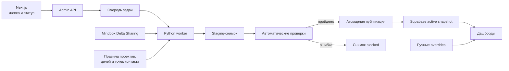

# Push Analytics: поэтапный план автоматизации обновления данных

**Статус:** активный план разработки; этапы 0–1 завершены

**Дата:** 30 июля 2026 года

**Область:** массовые и trigger MobilePush, проекты пушей, отправки, клики,
покупатели, заказы, товары и кастомная last-click атрибуция за 24 часа

**Связанный документ:** [`architecture_and_data_model.md`](architecture_and_data_model.md)

## 1. Цель

Сделать обновление Push Analytics воспроизводимым и безопасным:

1. Сотрудник создаёт массовый или trigger-пуш в Mindbox и помещает его в
   правильную проектную папку.
2. После ежедневного обновления аналитической выгрузки Mindbox сотрудник
   нажимает «Обновить данные» либо срабатывает плановый запуск.
3. Система находит новые и изменённые рассылки, статусы сообщений, клики,
   заказы, позиции заказов и объединения клиентов.
4. Проект пуша определяется по папке Mindbox.
5. Android- и iOS-варианты объединяются в один логический пуш.
6. Заказы пересчитываются по единой модели последнего MobilePush-клика за
   24 часа.
7. Результат проверяется до публикации.
8. Дашборд переключается на новый набор данных только после прохождения всех
   блокирующих проверок.
9. Сотрудник вручную добавляет только текст и при необходимости исправляет
   исключения через `/pushes`.

## 2. Что означает «корректная аналитика»

Абсолютную 100% гарантию относительно реального мира дать нельзя: проект
получает только те события, которые приложения и серверы передали в Mindbox, а
аналитическая интеграция Mindbox заявляет не менее 99% доступности данных
проекта. Поэтому гарантия формулируется так:

> Дашборд показывает только сертифицированный снимок: 100% полученных от
> Mindbox данных обработаны по зафиксированным правилам, все обязательные
> связи и арифметические инварианты проверены, результат воспроизводим по
> версиям источника, конфигурации и кода.

Нужно разделять четыре уровня уверенности:

| Уровень | Значение | Можно показывать как актуальную аналитику |
| --- | --- | --- |
| `blocked` | Загрузка или блокирующая проверка завершилась ошибкой | Нет |
| `loaded` | Данные получены, но расчёт или сверка не завершены | Нет |
| `verified` | Автоматические проверки пройдены | Да |
| `reconciled` | Автоматические проверки и выборочная ручная сверка пройдены | Да, максимальная уверенность |

На дашборде всегда должны быть видны:

- дата и время последнего доступного события Mindbox;
- время запуска синхронизации;
- статус снимка;
- версия расчёта;
- количество предупреждений;
- ссылка на отчёт качества.

Если источник старше 36 часов, дашборд остаётся доступным, но получает заметный
статус «Данные устарели». Если новый расчёт не прошёл проверки, пользователи
продолжают видеть предыдущий сертифицированный снимок.

## 3. Зафиксированные бизнес-правила

### 3.1. Проекты пушей

| Папка Mindbox | `project_id` | Проект |
| --- | --- | --- |
| `Пуши по 05ру в приложении 05ру` | `05-main` | Основное приложение 05.ru |
| `Пуши по Близко в приложении 05ру` | `blizko-in-05` | Blizko внутри приложения 05.ru |
| `Пуши в отдельном приложении Близко` | `blizko-app` | Отдельное приложение Blizko |

Название используется только для первоначального обнаружения папки. После
обнаружения система сохраняет стабильный `CDP.Folders.internalId` и определяет
проект по ID. Для вложенной папки проект наследуется от ближайшей проектной
папки по цепочке `parentInternalId`.

Правила приоритета:

1. Ручное переопределение проекта в `push_manual_overrides`.
2. Зафиксированный проект уже отправленного пуша.
3. Точное правило конкретного `mailingInternalId` для исторических исключений.
4. Проектная папка или её дочерняя папка.
5. Неизвестный проект — блокирующая проблема для публикации нового пуша.

До первой фактической отправки проект черновика может меняться вместе с папкой.
После появления `Sent` проект фиксируется. Перемещение уже отправленной
рассылки в другую папку создаёт проблему качества
`folder_moved_after_send`, но не меняет историческую аналитику автоматически.
Корректировка выполняется через `/pushes` и записывается в журнал.

### 3.2. Проект заказа

Проект покупки определяется независимо от проекта пуша, только по
`ProcessingOrders.Orders.firstPointOfContactInternalId`.

Должны поддерживаться три результата:

- `05-main`;
- `blizko-in-05`;
- `blizko-app`.

Новая неизвестная точка контакта не должна автоматически относиться к
`05-main`. Такой заказ попадает в карантин расчёта, а синхронизация создаёт
проблему `unknown_order_point`.

### 3.3. Основной аналитический срез «покупка в проекте пуша»

Проект пуша и проект заказа остаются двумя независимо рассчитанными полями в
хранилище. Основной интерфейс применяет к ним обязательное условие:

```text
effective_push_project_id IN selected_project_ids
AND order_project_id = effective_push_project_id
```

`effective_push_project_id` учитывает ручное переопределение проекта. Если
выбрано несколько проектов, условие применяется отдельно к каждому пушу:
покупка пуша `blizko-app` не может попасть в показатели пуша `05-main` только
потому, что оба проекта выбраны одновременно.

Порядок расчёта принципиален:

1. Сначала глобально выбирается единственный last-click победитель заказа
   среди `mass`, `trigger` и `transaction`.
2. Заказ сохраняется с фактическим `order_project_id`, даже если он отличается
   от проекта победившего пуша.
3. Затем основной API и дашборд оставляют для бизнес-аналитики только заказы,
   где проект заказа совпал с effective-проектом конкретного пуша.

Кросс-проектные победители не удаляются и не переатрибутируются. Они остаются
в деталях хранения и quality-аудите: это позволяет расследовать переходы между
приложениями и контролировать корректность классификации.

Риски и обязательные меры:

| Риск | Контроль |
| --- | --- |
| Ошибка проекта пуша исключит корректные покупки или включит чужие | Неизвестные папки блокируют публикацию; effective-проект виден в `/pushes`; override журналируется |
| `order_project_id IN selected_project_ids` смешает покупки нескольких проектов | API принимает параллельные пары `push_id/project_id` и проверяет равенство по строке |
| Сумма `buyers` отдельных пушей задвоит клиента | Точный `COUNT(DISTINCT buyer_key)` выполняется после same-project фильтра в RPC |
| Кросс-проектный путь пользователя станет невидим в основном отчете | Полный слой атрибуции сохраняется; отдельная quality-сверка считает matched/cross-project |
| Ручная смена проекта изменит исторические KPI | История override обязательна; API везде использует одно effective-значение; изменение проверяется до сохранения |
| Старые агрегаты «пуш × цель» включают все проекты заказа | Основной API берет разрез «пуш × цель × проект заказа», а не общий агрегат |

### 3.4. Атрибуция

Модель проекта:

```text
click_time <= order_time <= click_time + 24 часа
```

Для каждого заказа:

1. Клиент нормализуется через всю цепочку `CDP.MergedCustomers`.
2. Выбираются только события `Clicked` рассылок с
   `Mailings.Mailings.channel = MobilePush`.
3. В конкуренции участвуют типы `mass`, `trigger` и `transaction`.
4. Побеждает последний клик, произошедший не позже заказа.
5. Если между кликом и заказом больше 24 часов, победителя нет.
6. Победитель может быть только один для физического заказа.
7. Если победил `mass`, заказ показывается в массовом отчёте.
8. Если победил `trigger`, заказ показывается в trigger-отчёте.
9. Если победил `transaction`, заказ не показывается ни в одном из этих двух
   отчётов, но причина сохраняется для аудита.
10. После выбора победителя заказ независимо проверяется по каждой цели.

Клики Email, SMS, WebPush и других каналов не должны участвовать в кастомной
MobilePush-атрибуции.

### 3.5. Метрики сообщений

Расчёт ведётся по уникальному `messageId` внутри рассылки:

- `sent` — экземпляр имеет `Sent`;
- `not_delivered` — экземпляр имеет `NotDelivered`;
- `delivered = max(sent - not_delivered, 0)`;
- `clicked` — экземпляр имеет `Clicked`;
- `CTR = clicked / delivered`, если `delivered > 0`;
- «Открыли» в текущем интерфейсе означает `Clicked`, а не отдельный факт показа
  push на экране.

### 3.6. Тексты

Отсутствие ручного текста не блокирует загрузку аналитики:

- временное название берётся из `Mailings.Mailings.name`;
- `title` и `body` могут быть пустыми;
- пуш получает `content_status = missing`;
- на `/pushes` появляется очередь «Нужно заполнить текст»;
- после сохранения текста ручное переопределение применяется без повторного
  пересчёта метрик.

### 3.7. Свежесть и предварительные данные

Кнопка не может получить из аналитической интеграции события, которых Mindbox
ещё не опубликовал. Сертифицированный слой строится только по Delta Sharing,
который обновляется раз в сутки.

Если позднее потребуется видеть сегодняшние отправки и клики раньше Delta,
можно добавить отдельный предварительный слой через API отчётов Mindbox. Такой
слой должен:

- называться «Предварительные данные»;
- иметь отдельное время обновления;
- не смешиваться с сертифицированными заказами и кастомной атрибуцией;
- автоматически заменяться Delta-данными после следующего обновления;
- никогда не использоваться для финального сравнения выручки.

## 4. Целевая архитектура



Next.js не должен выполнять тяжёлый Python-расчёт внутри одного HTTP-запроса.
API только ставит задачу в очередь и возвращает её ID. Отдельный worker
обрабатывает задачу, обновляет прогресс и heartbeat.

Для очереди сначала проверить доступность `pgmq` в self-hosted Supabase.
Если расширение доступно, использовать durable queue. Если нет — использовать
закрытую таблицу `push_sync_jobs` с блокировкой `FOR UPDATE SKIP LOCKED`.
Очередь не должна быть доступна `anon` или `authenticated`.

## 5. Изменения модели данных

Все изменения оформляются отдельными миграциями. Таблицы в `public` получают
RLS и минимальные grants. Служебные staging-таблицы и privileged-функции
размещаются в закрытой схеме `private`.

### 5.1. `push_mindbox_folders`

Актуальный справочник папок Mindbox:

| Поле | Назначение |
| --- | --- |
| `internal_id` | Стабильный ID Mindbox, primary key |
| `system_name` | Системное имя |
| `name` | Отображаемое название |
| `parent_internal_id` | Родительская папка |
| `resolved_project_id` | Унаследованный проект |
| `is_project_root` | Является ли папка одной из трёх корневых |
| `is_deleted` | Удалена ли папка |
| `source_rowversion_at` | `_rowversion_ts` источника |
| `last_seen_at` | Последняя синхронизация |

### 5.2. `push_mailing_variants`

Одна строка на конкретную рассылку Mindbox:

| Поле | Назначение |
| --- | --- |
| `mailing_internal_id` | Primary key |
| `mailing_type` | `mass`, `trigger` или `transaction` |
| `channel` | Должен быть `MobilePush` для анализируемых вариантов |
| `folder_internal_id` | Папка Mindbox |
| `resolved_project_id` | Проект по правилам |
| `project_locked_at` | Момент фиксации проекта после первой отправки |
| `campaign_id` | Связь с массовой кампанией |
| `scenario_mailing_id` | Связь с trigger-сообщением |
| `platform` | `ios`, `android` или `unknown` |
| `mindbox_name` | Название Mindbox |
| `system_name` | Системное имя |
| `utm_campaign` | Дополнительный ключ группировки |
| `creation_at` | Создание в Mindbox |
| `source_updated_at` | Изменение в Mindbox |
| `is_deleted` | Удаление |
| `last_seen_at` | Последнее обнаружение |

### 5.3. `push_goal_rules`

Версионированная конфигурация целей:

- `goal_id`;
- допустимые точки контакта;
- категории статусов;
- внешние статусы;
- режим совпадения `any` / `all`;
- дата начала действия;
- дата окончания действия;
- версия;
- автор изменения;
- комментарий.

Правило, использованное в снимке, включается в `config_hash`. Изменение цели
создаёт новую версию правила, а не незаметно переписывает историю.

### 5.4. `push_dataset_snapshots`

Один воспроизводимый набор аналитики:

| Поле | Назначение |
| --- | --- |
| `id` | UUID снимка |
| `status` | `building`, `verified`, `reconciled`, `blocked`, `archived` |
| `mode` | `full` или `incremental` |
| `source_versions` | Версии всех Delta-таблиц |
| `source_data_through` | Максимальный `_rowversion_ts` |
| `config_hash` | Хэш правил проектов, целей и точек контакта |
| `code_version` | Git commit worker |
| `started_at` | Начало |
| `finished_at` | Завершение |
| `quality_summary` | Итог проверок |
| `is_active` | Активный снимок |

Активным может быть только один снимок. Переключение активного снимка
происходит одной транзакцией после проверок.

### 5.5. `push_data_quality_issues`

| Поле | Назначение |
| --- | --- |
| `snapshot_id` | Проверяемый снимок |
| `check_code` | Стабильный код проверки |
| `severity` | `blocker`, `warning`, `info` |
| `entity_type` | Папка, рассылка, кампания, заказ, товар |
| `entity_key` | Безопасный идентификатор |
| `details` | PII-free описание |
| `status` | `open`, `accepted`, `resolved` |
| `created_at` | Обнаружение |
| `resolved_at` | Исправление |

### 5.6. Расширение `push_sync_runs`

Добавить:

- `trigger_source`: `button`, `schedule`, `retry`, `cli`;
- `triggered_by`;
- `mode`: `full` / `incremental`;
- `phase`;
- `progress_percent`;
- `heartbeat_at`;
- `snapshot_id`;
- `source_versions_before`;
- `source_versions_after`;
- `new_mailings`;
- `updated_mailings`;
- `orders_processed`;
- `quality_blockers`;
- `quality_warnings`;
- `retry_of_run_id`.

Нужен partial unique index, запрещающий две одновременные задачи в статусах
`queued` или `running`.

### 5.7. Изменение `push_click_touchpoints`

Разрешить `source_kind = transaction`. Для transaction-клика ссылки на
`campaign_id` и `scenario_mailing_id` могут быть пустыми, но сохраняются:

- `mailing_internal_id`;
- HMAC-покупатель;
- HMAC-экземпляр сообщения;
- время клика;
- проект рассылки, если он определён.

Это нужно для аудита заказов, которые «забрал» transaction-пуш.

### 5.8. Версионирование расчётных таблиц

Добавить `snapshot_id` или `sync_run_id` во все расчётные сущности:

- метрики кампаний;
- дневные trigger-метрики;
- click touchpoints;
- атрибутированные заказы;
- товарные строки заказов.

Сайт читает только активный снимок. Старые снимки хранятся минимум 30 дней или
последние 10 успешных запусков. Это позволяет откатиться без повторного
расчёта.

## 6. Поэтапный процесс разработки

## Этап 0. Зафиксировать текущий эталон

**Статус:** завершён 30 июля 2026 года с предупреждениями о свежести.

Воспроизводимый PII-free baseline:
[`baselines/2026-07-30/README.md`](../baselines/2026-07-30/README.md).
Зафиксированы Git commit, версии девяти Delta-таблиц, effective-конфигурация,
полный Supabase-срез, все восемь trigger-пушей, 11 массовых пушей и
113 заказов с трассировкой всех конкурирующих MobilePush-кликов. Все 113
опубликованных победителей подтверждены повторным расчетом.

Автоматические валидаторы, ESLint и production build прошли. Ручная сверка
приложений, текстов и известных кампаний выполнена в Mindbox UI. Выявлено
ожидаемое расхождение свежести: `За окном +30` имеет 16 001 клик в Mindbox UI
и 15 727 в опубликованном Supabase-снимке, поскольку локальный
`CustomerMessagesStatuses` отстаёт на 10 Delta-версий. На следующих этапах
неполный coverage должен блокировать публикацию, а не только создавать
предупреждение.

### Задачи

1. Сохранить версии всех используемых Delta-таблиц.
2. Сохранить Git commit текущего расчёта.
3. Выгрузить текущие агрегаты Supabase.
4. Сохранить текущие правила:
   - проекты;
   - mailing overrides;
   - цели;
   - точки контакта;
   - объединение Android/iOS;
   - ручные overrides.
5. Составить golden-набор минимум из:
   - 10 массовых пушей;
   - всех текущих trigger-пушей;
   - минимум 20 атрибутированных заказов каждого проекта, если они есть;
   - заказов без атрибуции;
   - заказов, которые выиграл transaction-пуш;
   - заказов ровно на границах окна.
6. Для каждого golden-заказа сохранить PII-free трассировку:
   - заказ;
   - канонический покупатель;
   - все MobilePush-клики за предыдущие 24 часа;
   - победивший клик;
   - цель;
   - проект пуша;
   - проект покупки;
   - сумма;
   - товарные строки.

### Первоначальные ручные сверки

Обязательно включить известные спорные кейсы:

- пуш `К матчу готовы?` и его заказы в отдельном приложении Blizko;
- пуш 2 июля `За окном +30` и ранее показанные 24 заказа;
- по одному пушу каждого проекта с нулём заказов;
- один trigger-пуш с покупками;
- один заказ, перед которым были mass и trigger клики;
- один заказ, перед которым был более поздний transaction-клик.

Счётчики фиксируются вместе с версиями источника. Если Mindbox позднее изменит
события, golden-ожидание меняется только после документированной повторной
сверки.

### Тесты

- существующие `validate_supabase_data.py`;
- существующие `validate_trigger_supabase_data.py`;
- `npm run lint`;
- `npm run build`;
- SQL-сверка сумм агрегатов и деталей;
- выборочная сверка Mindbox UI.

### Критерий завершения

Получен воспроизводимый baseline, для каждого ключевого числа известны версия
источника, код и правило расчёта.

## Этап 1. Создать автоматические тесты до рефакторинга

**Статус:** завершён 30 июля 2026 года.

Добавлен чистый модуль
[`scripts/push_analytics_core.py`](../scripts/push_analytics_core.py), который
фиксирует правила Delta current state, папок и проектов, группировки
Android/iOS, статусов сообщений, объединения клиентов, глобальной MobilePush
last-click атрибуции, целей и агрегатов. Production builders на него пока не
переключены: это произойдёт отдельными контролируемыми этапами после сравнения
с golden baseline.

Результат проверки после добавления same-project бизнес-среза:

- 54 unit-теста, 100% statement и branch coverage core-модуля;
- 1 синтетический integration pipeline;
- 8 regression/security-тестов;
- 6 read-only SQL-сверок с живым Supabase;
- 19 проверок frozen baseline;
- существующие mass/trigger валидаторы, ESLint и production build прошли;
- все 113 опубликованных golden-заказов воспроизводятся без изменения
  победителя и окна атрибуции.

Дополнительно применена ограниченная миграция
`20260730075709_matching_project_buyer_counts.sql`: две `security invoker`
RPC-функции считают точных уникальных покупателей только при совпадении
проекта заказа с effective-проектом соответствующего массового или
trigger-пуша. Миграция не меняет исходные строки атрибуции.

CI описан в
[`.github/workflows/push-analytics-quality.yml`](../.github/workflows/push-analytics-quality.yml).
Offline gate не требует секретов. Live Supabase gate требует CI secrets и
выполняет только чтение. Единственное изменение production-схемы на этом шаге
ограничено двумя read-only RPC-функциями same-project подсчёта. Проверка
применения полного набора миграций на чистую базу должна быть добавлена до
этапа 5.

### Структура тестов

```text
tests/
  fixtures/
    delta/
    golden/
  unit/
  integration/
  regression/
  sql/
```

### Unit-тесты Delta

1. Выбирается строка с максимальным `_rowversion_ts`.
2. `_isDeleted = true` удаляет сущность из актуального состояния.
3. Повторная загрузка одной версии не создаёт дубликаты.
4. Пропуск версии обнаруживается и блокирует cursor.
5. Смена схемы или отсутствие обязательной колонки останавливает публикацию.
6. Пустая новая версия корректно обрабатывается.

### Unit-тесты папок

1. Каждая из трёх папок получает правильный проект.
2. Дочерняя папка наследует проект.
3. Две проектные папки с одинаковым названием считаются неоднозначностью.
4. Цикл в `parentInternalId` обнаруживается.
5. Удалённая папка не используется для нового пуша.
6. Перемещение отправленного пуша не меняет зафиксированный проект.
7. Ручной override имеет высший приоритет.
8. Неизвестная папка не получает fallback `05-main`.

### Unit-тесты группировки Android/iOS

Приоритет логического ключа:

1. Явное ручное правило группировки.
2. Общий непустой `utmCampaign`.
3. Общая основа `systemName` после удаления платформенного суффикса.
4. Нормализованное имя, один проект и допустимая близость времени отправки.

Тесты:

- iOS и Android одного пуша объединяются;
- одинаковые названия разных дат не объединяются;
- варианты разных проектов не объединяются;
- неоднозначные три варианта создают blocker;
- удалённый вариант не удваивает метрики;
- разные A/B-варианты не смешиваются без явного правила.

### Unit-тесты статусов

- один `messageId` с повторным `Sent` считается один раз;
- `NotDelivered` уменьшает доставку один раз;
- повторный `Clicked` одного экземпляра считается один раз;
- `clicked <= sent`;
- `delivered = max(sent - not_delivered, 0)`;
- пустой знаменатель даёт `CTR = 0`, а не ошибку или бесконечность.

### Unit-тесты объединения клиентов

- простое объединение;
- цепочка из нескольких объединений;
- объединения после клика, но до заказа;
- повторная строка объединения;
- цикл — blocker;
- два исходных клиента становятся одним покупателем.

### Unit-тесты атрибуции

1. Один клик и заказ через 30 минут — заказ атрибутирован.
2. Заказ ровно через 24 часа — включён.
3. Заказ через 24 часа и одну секунду — исключён.
4. Клик после заказа — исключён.
5. Из двух mass-кликов побеждает последний.
6. Из mass и trigger побеждает последний.
7. Transaction-клик побеждает, но заказ не появляется в mass/trigger.
8. Более поздний Email-клик не влияет на MobilePush-победителя.
9. Клик другого клиента не участвует.
10. Заказ без клиента не атрибутируется и учитывается в отчёте полноты.
11. Один заказ имеет одного победителя.
12. Один заказ может попасть в несколько целей, но не дублируется внутри цели.
13. `buyer_key` объединённых клиентов считается один раз.
14. Отрицательная задержка невозможна.
15. Все времена нормализуются в UTC; календарные группировки — в
    `Europe/Moscow`.

### Unit-тесты целей и суммы

- каждая цель проверяется по своей версии правил;
- неизвестный статус создаёт issue;
- сумма берётся из `priceWithDiscounts`, затем `paidAmount`, затем `0`;
- количество заказов считается по уникальному `order_key`;
- покупатели — по уникальному `buyer_key`;
- выручка равна сумме деталей;
- товарные строки не умножают число заказов.

### Обязательные CI-gates

Каждый pull request, затрагивающий ingestion, правила или расчёты, должен
выполнять:

```bash
pytest tests/unit
pytest tests/integration
pytest tests/regression
python scripts/validate_supabase_data.py
python scripts/validate_trigger_supabase_data.py
cd dashboard && npm run lint && npm run build
```

Дополнительно:

- core-модули project resolver, customer merge и attribution должны иметь
  100% branch coverage;
- общий coverage проекта не ниже согласованного порога;
- миграции проверяются на чистой базе и поверх копии текущей схемы;
- secret scan запрещает попадание ключей и PII;
- SQL-тесты сравнивают агрегаты и детали;
- изменение golden-ожиданий требует отдельного описания причины и ручного
  подтверждения;
- успешный coverage не заменяет golden- и reconciliation-тесты.

### Критерий завершения

Все текущие golden-результаты воспроизводятся до изменения архитектуры.

## Этап 2. Автоматизировать папки и проекты

### Задачи

1. Добавить чтение `CDP.Folders`.
2. Дождаться появления трёх новых папок после ежедневного обновления Mindbox.
3. Найти папки по точным названиям.
4. Потребовать ровно одно совпадение для каждого названия.
5. Сохранить ID в `push_mindbox_folders` и `push_project_rules`.
6. Добавить обход родительской цепочки.
7. Перевести массовые и trigger-пуши на один resolver проекта.
8. Удалить fallback trigger → `05-main`.
9. Сохранить старые mailing overrides только для исторических пушей.

### Проверки

- 100% опубликованных MobilePush имеют проект;
- 0 неизвестных папок среди новых отправленных пушей;
- Android/iOS-варианты одной кампании имеют один проект;
- распределение количества пушей по проектам сравнивается с предыдущим
  снимком;
- изменение доли проекта более чем на заданный порог создаёт warning.

### Критерий завершения

Новый пуш в любой из трёх папок автоматически получает правильный проект без
изменения JSON или кода.

## Этап 3. Ввести единый слой рассылок и вариантов

### Задачи

1. Загружать все `MobilePush` типов `mass`, `trigger`, `transaction`.
2. Сохранять каждый вариант в `push_mailing_variants`.
3. Разделить:
   - сущность варианта Mindbox;
   - логическую mass-кампанию;
   - логическое trigger-сообщение.
4. Реализовать детерминированный grouping resolver.
5. Помечать неоднозначные варианты вместо случайного объединения.
6. Разрешить новый mass-пуш без текста.
7. Сохранить `content_status`.

### Проверки

- каждый `mailingInternalId` связан максимум с одной логической сущностью;
- один логический пуш не содержит варианты разных проектов;
- mass и trigger не объединяются;
- transaction никогда не появляется в пользовательских списках mass/trigger;
- ручной текст и проект переживают повторную синхронизацию.

### Критерий завершения

Новая рассылка появляется в базе и в `/pushes` автоматически, даже если текст
ещё не заполнен.

## Этап 4. Объединить расчёт сообщений и атрибуцию

### Задачи

1. Вынести общий модуль чтения актуального состояния Delta.
2. Вынести общий модуль нормализации клиентов.
3. Вынести общий индекс MobilePush-кликов.
4. Вынести общий resolver целей.
5. Один раз выбрать победителя заказа.
6. После выбора победителя разложить результаты по mass, trigger и
   transaction.
7. Обеспечить одинаковые функции расчёта для полного и инкрементального режима.

### Блокирующие инварианты

- нет двух победителей одного заказа;
- победивший клик принадлежит тому же каноническому покупателю;
- клик имеет `channel = MobilePush`;
- задержка в диапазоне `0..1440` минут;
- `attributed_click_at <= purchased_at`;
- каждый опубликованный заказ имеет известный `order_project_id`;
- число заказов агрегата равно числу строк деталей;
- число покупателей равно `COUNT(DISTINCT buyer_key)`;
- выручка агрегата равна сумме заказов;
- интервалы задержки суммируются в общее число заказов.
- основной бизнес-срез содержит только строки
  `order_project_id = effective_push_project_id`;
- объединение нескольких выбранных проектов равно объединению независимых
  same-project срезов, а не общему `order_project_id IN (...)`;
- кросс-проектные строки сохранены в исходном слое и доступны quality-аудиту.

### Критерий завершения

Массовый и trigger-дашборды используют одного победителя и не могут
одновременно присвоить себе один физический заказ.

## Этап 5. Сделать атомарную публикацию

### Задачи

1. Создать `push_dataset_snapshots`.
2. Записывать новый расчёт в staging с новым `snapshot_id`.
3. Не удалять данные активного снимка во время расчёта.
4. Выполнить все SQL-проверки staging-набора.
5. В одной транзакции:
   - пометить новый снимок `verified`;
   - снять `is_active` с предыдущего;
   - активировать новый;
   - продвинуть Delta cursors.
6. При любой ошибке:
   - откатить транзакцию;
   - оставить предыдущий снимок активным;
   - записать `blocked` и причину.
7. Реализовать ручной rollback на предыдущий verified-снимок.

### Тесты отказоустойчивости

- ошибка после загрузки кампаний;
- ошибка после удаления staging-строк;
- потеря связи с Supabase;
- worker завершён принудительно;
- повторный запуск того же задания;
- два параллельных запуска;
- истёкший heartbeat;
- повреждённый payload;
- недостаточно прав для публикации.

Во всех случаях активная аналитика должна оставаться целой.

### Критерий завершения

Частично обновлённый набор данных физически невозможно увидеть через API
дашборда.

## Этап 6. Реализовать worker и очередь

### Задачи

1. Создать отдельную команду:

   ```bash
   push-analytics-worker sync --mode full
   push-analytics-worker sync --mode incremental
   ```

2. Добавить durable job queue.
3. Добавить advisory lock или уникальную блокировку активной задачи.
4. Добавить heartbeat.
5. Добавить ограниченные повторные попытки с backoff.
6. Не повторять автоматически ошибки качества.
7. Разделить этапы:
   - `discovering_versions`;
   - `downloading`;
   - `normalizing`;
   - `classifying`;
   - `grouping`;
   - `calculating_messages`;
   - `calculating_attribution`;
   - `validating`;
   - `publishing`;
   - `succeeded`.
8. Писать логи без Mindbox customer ID, номера заказа и секретов.
9. Хранить raw Parquet на зашифрованном persistent volume, исключённом из Git.

### Безопасность

Worker использует серверные:

- `URL_DATABASE`;
- `SECRET_KEY`;
- `SHIFR_KEY`;
- `SUPABASE_SERVICE_ROLE_KEY` или отдельную ограниченную Postgres-роль.

Ни одна из этих переменных не получает префикс `NEXT_PUBLIC_`. Для HMAC
покупателей используется стабильный отдельный секрет. Его нельзя менять без
плана миграции, иначе уникальные покупатели перестанут сопоставляться между
запусками.

### Критерий завершения

Worker можно безопасно остановить, повторить и запустить после сбоя без
дубликатов и потери опубликованной аналитики.

## Этап 7. Добавить API и кнопку

**Статус:** same-project мультивыбор и аналитические API реализованы досрочно
30 июля 2026 года; admin sync API, очередь, прогресс и кнопка обновления
ожидают этапов 5–7.

### API

```text
POST /api/admin/sync
GET  /api/admin/sync/current
GET  /api/admin/sync/{runId}
GET  /api/admin/sync/{runId}/quality
POST /api/admin/sync/{runId}/retry
POST /api/admin/snapshots/{snapshotId}/activate
```

`POST /api/admin/sync`:

- проверяет `PUSH_ANALYTICS_ADMIN_KEY`;
- принимает `mode = incremental | full`;
- принимает idempotency key;
- не создаёт вторую задачу, если одна уже выполняется;
- возвращает `202 Accepted` и `runId`.

### Интерфейс

В верхней части сайта:

- кнопка «Обновить данные»;
- единый мультивыбор проектов пушей;
- явная подпись «Покупки учитываются только внутри проекта каждого пуша»;
- дата данных Mindbox;
- дата последнего успешного запуска;
- статус `verified` / `reconciled` / `stale`;
- количество незаполненных текстов;
- количество проблем качества.

Во время запуска:

- кнопка заблокирована;
- показывается текущий этап;
- показывается прогресс;
- переход со страницы не отменяет задачу;
- после завершения API дашборда перезапрашивается.

Итог запуска:

```text
Новых пушей: 4
Обновлено пушей: 12
Новых заказов: 23
Нужно заполнить текст: 4
Предупреждения: 1
Данные Mindbox актуальны на: 29.07.2026 03:00 МСК
```

### Тесты

- неверный admin key — `401`;
- обычный клиент не может создать задачу;
- повторный idempotency key возвращает тот же запуск;
- параллельный клик не создаёт второй запуск;
- UI корректно восстанавливается после перезагрузки;
- ошибка worker отображается без технических секретов;
- успешный запуск обновляет данные без полного reload браузера.
- выбор нескольких проектов показывает пуши выбранных проектов и для каждого
  пуша учитывает только покупки его собственного effective-проекта;
- отдельного пользовательского фильтра «Где сделана покупка» в основном
  интерфейсе нет;
- смена ручного проекта пуша сразу меняет его same-project срез, не переписывая
  `order_project_id`.

### Критерий завершения

Сотрудник может запустить обновление и понять его результат без доступа к
терминалу.

## Этап 8. Автоматизировать каталог товаров

Delta-таблицы заказов содержат product ID, количество и цены, но не всегда
человекочитаемое название. Чтобы после автоматизации сотруднику не приходилось
регулярно загружать CSV вручную, нужен отдельный поток каталога.

### Задачи

1. Проверить возможность создать в Mindbox серверную операцию экспорта
   продуктов.
2. Если операция доступна:
   - worker ставит экспорт;
   - ожидает завершения с ограниченным polling;
   - скачивает файл;
   - валидирует схему и кодировку;
   - upsert-ит `push_products`;
   - обновляет fallback-названия существующих товарных строк.
3. Если серверный экспорт недоступен, подключить API или выгрузку основной
   товарной системы как более подходящий источник названий.
4. Зафиксировать приоритет идентификаторов:
   - `productInternalId`;
   - внешний ID и внешняя система;
   - артикул.
5. Не удалять старое название товара при временном отсутствии товара в новом
   файле.

### Проверки

- один product ID не получает два разных активных названия без warning;
- join каталога не умножает товарные строки;
- сумма и число заказов не зависят от наличия названия;
- доля распознанных товаров показывается в quality report;
- ошибка каталога создаёт warning, но не уничтожает корректные метрики заказа;
- при отсутствии названия интерфейс явно показывает SKU/ID как fallback.

### Критерий завершения

Названия новых товаров обновляются без ручного CSV, а сбой каталога не влияет
на количество заказов, покупателей и выручку.

## Этап 9. Подключить расписание

Аналитическая выгрузка Mindbox обновляется раз в сутки к `00:00 UTC`.
Рекомендуемый запуск:

```text
Ежедневно в 03:30–04:00 Europe/Moscow
```

Дополнительно:

- кнопка запускает внеплановый incremental-sync;
- раз в неделю выполняется полный контрольный rebuild;
- если ежедневный запуск пропущен, создаётся alert;
- если источник не изменился, создаётся успешный запуск
  `no_source_changes`, а новый снимок не публикуется.

### Критерий завершения

Новые данные появляются автоматически; кнопка используется для повторной
проверки или срочного запуска.

## Этап 10. Перейти на инкрементальное обновление

Сначала production должен работать на полной идемпотентной пересборке. Только
после этого включается инкрементальный режим.

### Правила dirty-set

Пересчитать заказ, если изменилось хотя бы одно:

- сам заказ;
- любая его позиция;
- справочник статуса позиции;
- точка контакта;
- объединение клиента;
- MobilePush-клик того же клиента за предыдущие 24 часа;
- рассылка победившего клика;
- правило цели;
- правило проекта.

Новый клик делает dirty все заказы того же канонического клиента в интервале:

```text
click_time .. click_time + 24 часа
```

Изменение `MergedCustomers` делает dirty обе ветки объединения за весь
поддерживаемый аналитический период.

### Проверка эквивалентности

Инкрементальный режим не включается сразу:

1. Daily incremental строится в shadow.
2. Параллельно выполняется full rebuild.
3. Сравниваются:
   - кампании;
   - отправки;
   - клики;
   - заказы;
   - покупатели;
   - выручка;
   - каждый order winner;
   - каждый проект заказа;
   - товарные строки.
4. Требуется полное совпадение минимум 7 последовательных дней.
5. Любое расхождение возвращает основной режим на full rebuild.

### Критерий завершения

Инкрементальный и полный расчёт дают идентичный сертифицированный результат.

## 7. Полный набор проверок перед публикацией

### 7.1. Свежесть

- получены версии всех обязательных таблиц;
- ни одна версия не меньше сохранённого cursor;
- зафиксирован максимальный `_rowversion_ts`;
- источник не старше допустимого SLA;
- временные зоны явно преобразованы.

### 7.2. Полнота

- все новые MobilePush из трёх папок обнаружены;
- все отправленные анализируемые пуши имеют проект;
- все статусы ссылаются на известную рассылку либо объяснены;
- все атрибутированные заказы имеют позиции статусов;
- все опубликованные заказы имеют проект покупки;
- отсутствие названия товара не удаляет заказ, а создаёт warning;
- анонимные заказы посчитаны в отчёте потерь, но не атрибутированы без клиента.

### 7.3. Уникальность и зерно

- `mailingInternalId` уникален;
- `messageStatusId` уникален в актуальном состоянии;
- `messageId` не умножается соединениями;
- массовый заказ уникален по `campaign + goal + order`;
- глобальный победитель заказа уникален;
- товарная строка уникальна внутри заказа;
- покупатели считаются после customer merge.

### 7.4. Арифметика

- `sent >= delivered`;
- `sent >= not_delivered`;
- `delivered = sent - not_delivered`;
- `clicked <= sent`;
- `0 <= CTR <= 100%`;
- сумма platform delivery равна общей доставке;
- сумма latency buckets равна заказам;
- сумма order revenue равна агрегированной выручке;
- сумма заказов по проектам покупки равна полному числу атрибутированных
  заказов в диагностическом слое;
- сумма основных KPI равна сумме деталей, где
  `order_project_id = effective_push_project_id`;
- мультивыбор проектов равен сумме same-project метрик выбранных пушей;
- покупатели не превышают заказы;
- покупатели мультивыбора равны `COUNT(DISTINCT buyer_key)` после
  same-project-фильтра, а не сумме покупателей отдельных пушей;
- средний чек считается как `revenue / orders`.

### 7.5. Атрибуция

- только MobilePush;
- только клик не позже заказа;
- окно не больше 24 часов;
- победил самый поздний допустимый клик;
- transaction-победители исключены из пользовательских mass/trigger-отчётов;
- Email/SMS не прерывают кастомную MobilePush-атрибуцию;
- цели применены после выбора победителя;
- один физический заказ не присвоен двум push-победителям.

### 7.6. Проекты

- проект пуша не выводится из проекта заказа;
- проект заказа не выводится из папки пуша;
- ручной override применяется до фильтрации дашборда;
- ручная смена проекта пуша не меняет `order_project_id`;
- основной бизнес-срез применяет равенство проектов только после глобального
  выбора победителя атрибуции;
- для каждого пуша в мультивыборе используется его собственный effective-проект;
- кросс-проектная покупка не попадает в основные KPI, но остается в базе и
  диагностике;
- неизвестная папка не получает fallback;
- неизвестная точка контакта не получает fallback.

### 7.7. Supabase и API

- активен только один снимок;
- staging-строки не видны Data API;
- `anon` не может писать;
- `authenticated` не может писать служебные таблицы;
- service role отсутствует в клиентском bundle;
- ручные overrides доступны только admin API;
- views используют `security_invoker = true` либо закрыты от клиентских ролей;
- API возвращает только активный verified/reconciled snapshot;
- API-агрегаты совпадают с SQL-агрегатами.

### 7.8. Интерфейс

- единый мультивыбор фильтрует проекты пушей;
- для каждого выбранного пуша автоматически учитывается только
  `order_project_id`, равный effective-проекту этого пуша;
- можно выбрать один, несколько или все проекты; нельзя снять последний;
- отдельный фильтр проекта покупки отсутствует в основном интерфейсе;
- выбранная цель меняет только цель;
- лучший push ищется внутри выбранного проекта и фильтров;
- при нуле заказов не показывается ложный «лучший по заказам»;
- заказы и покупатели отображаются отдельно;
- детали заказа соответствуют выбранному пушу и цели;
- дата свежести и статус качества видны пользователю.

## 8. Ручная сверка перед первым production-запуском

Перед активацией автоматизации выполнить:

1. По 5 массовых пушей каждого проекта:
   - название;
   - папка;
   - Android/iOS;
   - отправки;
   - клики.
2. Все текущие trigger-пуши:
   - сценарий;
   - проект;
   - дневные отправки;
   - клики.
3. Не менее 20 заказов каждого проекта:
   - время заказа;
   - покупатель;
   - все MobilePush-клики;
   - победитель;
   - задержка;
   - цель;
   - сумма;
   - товары.
4. Не менее 10 заказов без атрибуции:
   - отсутствие клика;
   - клик старше 24 часов;
   - transaction-победитель;
   - неизвестный клиент.
5. Сверить с Mindbox UI и, где возможно, с экспортом отчёта.

Расхождения с отчётом Mindbox не считаются автоматически ошибкой, поскольку
официальная и кастомная модели атрибуции различаются. Для каждого расхождения
должна быть воспроизводимая трассировка и объяснение.

Результат ручной сверки записывается в snapshot как `reconciled`, с датой и
именем проверившего.

## 9. Наблюдаемость и предупреждения

Минимальные alerts:

- ежедневная задача не стартовала;
- задача выполняется дольше ожидаемого;
- heartbeat пропал;
- Mindbox source stale;
- появились неизвестные папки;
- появились неизвестные точки контакта;
- новый статус позиции не входит ни в одно правило;
- количество отправок или заказов изменилось аномально;
- число атрибутированных заказов упало до нуля;
- full и incremental расходятся;
- ручные overrides ссылаются на удалённые сущности;
- service credentials недействительны.

Для каждого запуска сохраняются:

- длительность этапов;
- скачанные версии и объём;
- число строк до и после deduplication;
- join coverage;
- число исключённых записей по каждой причине;
- итоговые метрики по проектам и типам рассылок;
- результаты всех checks.

## 10. Rollback

Rollback не пересчитывает данные:

1. Выбрать предыдущий `verified` или `reconciled` snapshot.
2. Проверить, что его конфигурация и схема совместимы с текущим API.
3. Одной транзакцией сменить active snapshot.
4. Очистить API cache.
5. Создать audit record с причиной.
6. Заблокированный новый снимок оставить для расследования.

Нельзя:

- исправлять расчётные строки напрямую в production;
- продвигать cursor после неуспешной публикации;
- удалять предыдущий снимок до окончания retention;
- скрывать blocker как обычный warning.

## 11. Что останется ручным после автоматизации

Регулярно:

- заполнить заголовок и текст нового пуша в `/pushes`.

Только при исключениях:

- разрешить неоднозначное объединение Android/iOS;
- классифицировать рассылку вне трёх папок;
- добавить новую точку контакта заказа;
- добавить или изменить правило цели;
- подтвердить новую категорию статуса;
- принять документированное предупреждение качества.

## 12. Порядок внедрения и запрет на сокращения

Рекомендуемый порядок:

1. Эталонный снимок и ручная сверка.
2. Test fixtures и unit-тесты.
3. Папки и project resolver.
4. `push_mailing_variants`.
5. Единый MobilePush click layer.
6. Единый attribution engine.
7. Версионированные goal rules.
8. Staging и active snapshot.
9. Failure tests и rollback.
10. Worker и очередь.
11. Admin API.
12. Кнопка и экран качества.
13. Автоматический каталог товаров.
14. Ежедневный full rebuild.
15. Семь дней shadow-сравнения.
16. Incremental mode.
17. Еженедельный контрольный full rebuild.

Нельзя начинать с кнопки. Кнопка без staging, тестов и блокирующих проверок
только автоматизирует публикацию потенциально некорректных данных.

## 13. Финальные критерии приёмки

Автоматизация готова к основной эксплуатации, когда одновременно выполнено:

- новый push в каждой из трёх папок появляется без изменения кода;
- проект всех новых пушей определён корректно;
- новый push без текста не блокирует синхронизацию;
- ручной текст и проект сохраняются после повторного обновления;
- массовые, trigger и transaction клики участвуют в одном расчёте;
- Email/SMS не участвуют в MobilePush-атрибуции;
- каждый заказ имеет не более одного победителя;
- каждый опубликованный заказ имеет проект покупки;
- основной дашборд не показывает кросс-проектные покупки в KPI, рейтинге,
  таблице и деталях;
- мультивыбор проектов корректно применяет равенство проектов отдельно к
  каждому пушу;
- кросс-проектные строки остаются доступны автоматическим quality-проверкам;
- агрегаты полностью сходятся с деталями;
- каталог обновляется автоматически либо явно показывает контролируемый
  fallback без влияния на метрики;
- full rebuild повторяется идемпотентно;
- отказ в любой точке не меняет активный снимок;
- rollback проверен;
- RLS и grants проверены;
- golden-набор совпадает;
- ручная сверка спорных кейсов завершена;
- семь последовательных shadow-запусков не дали расхождений;
- дашборд показывает freshness и статус качества;
- сотрудник видит понятный результат кнопки;
- есть ежедневный запуск и alerts.

## 14. Источники

- [Mindbox: экспорт данных для аналитики](https://help.mindbox.ru/docs/%D0%BA%D0%B0%D0%BA-%D0%BD%D0%B0%D1%81%D1%82%D1%80%D0%BE%D0%B8%D1%82%D1%8C-%D1%8D%D0%BA%D1%81%D0%BF%D0%BE%D1%80%D1%82-%D0%B4%D0%B0%D0%BD%D0%BD%D1%8B%D1%85-%D0%B4%D0%BB%D1%8F-%D0%B0%D0%BD%D0%B0%D0%BB%D0%B8%D1%82%D0%B8%D0%BA%D0%B8)
- [Mindbox: схема аналитических данных](https://developers.mindbox.ru/docs/analytics-data-schema)
- [Mindbox: справочник рассылок](https://developers.mindbox.ru/docs/mailings-reference)
- [Mindbox: статусы рассылок](https://developers.mindbox.ru/docs/mailing-statuses)
- [Mindbox: периодическое обновление данных](https://developers.mindbox.ru/docs/periodic-data-updates)
- [Mindbox: заказы клиентов](https://developers.mindbox.ru/docs/%D0%B7%D0%B0%D0%BA%D0%B0%D0%B7%D1%8B-%D0%BA%D0%BB%D0%B8%D0%B5%D0%BD%D1%82%D0%BE%D0%B2)
- [Mindbox: атрибуция заказов к кампаниям](https://help.mindbox.ru/docs/attribution)
- [Supabase: Row Level Security](https://supabase.com/docs/guides/database/postgres/row-level-security)
- [Supabase: защита данных и серверных ключей](https://supabase.com/docs/guides/database/secure-data)
- [Supabase Queues](https://supabase.com/docs/guides/queues)
